# Apache

&nbsp;

Para podemos instalar el servidor web apache necesitamos una maquina servidor, en nuestro caso utilizamos ubuntu server y debemos configurar la red de la máquina para ponemos dos adaptadores porque en nuestro caso tenemos 2 máquinas virtuales, servidor y el segunda donde hay los ficheros que debemos subir al servidor web apache. A continuamos con configuración de red para la maquina servidor, el primer adaptador es un adaptador solo-anfitrión necesitamos este adaptador para fijar la dirección ip de la maquina y el segundo es un adaptador puente para la red externa, y en otro lado ponemos solo un adaptador puente.

&nbsp;

***Maquina servidor***
> 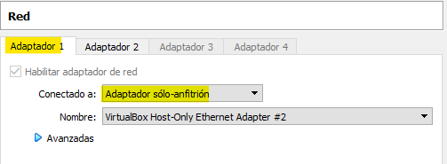

&nbsp;

> 

&nbsp;

***Maquina cliente***
> 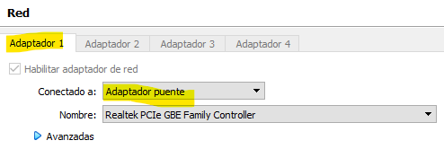

&nbsp;

Y ahora instalamos web server apache con el comando: 
***
*sudo apt install apache2* 
***
> 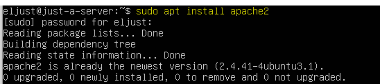

&nbsp;

Luego vamos al directorio **/var/www/html** es donde se ubican por defecto las páginas, organizadas en carpetas del servidor. Ahora hay que tener en cuenta también los permisos de esta carpeta, se nos crea un nuevo usuario y grupo **www-data**. Este es el usuario con el que se ejecuta el servidor web.

&nbsp;

Y como tenemos los permisos sobre todo de escritura de ficheros y directorios suelen estar restringidos a sus propietarios. Entonces que el servidor web Apache se ejecuta como root, en el momento en que se compromete la seguridad del servicio web, se tendría acceso al sistema con permisos de root. Pero nosotros queremos ejecutar como otro usuario para cuando si el servicio web se compromete, no se varia comprometido todo el servidor.

&nbsp;

Ahora va cambiar el grup propietario de la carpeta **/var/www/html** a **www-data** con el comando: 
> 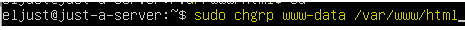

&nbsp;

Y luego añadimos nuestro usuario a este grupo (añadimos el grup **ww-data** a nuestra lista de grups) con el comando: 
> 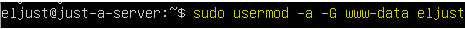

&nbsp;

Y después damos los siguientes permisos de forma recursiva (son dos comandos): 
> 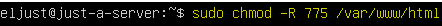
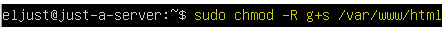

&nbsp;

Cuando terminamos, pasamos activar el **SUID** para el grupo porque con ella todo el que se cree dentro del directorio será propiedad también del grupo **www-data**, además también nos añadimos como a los propietarios de este directorio, para poder trabajar directamente con él: 
> 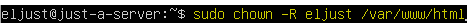

&nbsp;

Ahora cuando terminar de todo la resultad será la siguiente:
> 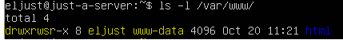

&nbsp;

Ahora pasamos a los pasos de subir los ficheros a servidor web apache.

&nbsp;
En primer debemos generar el sitio web con **Hugo -D**.
> 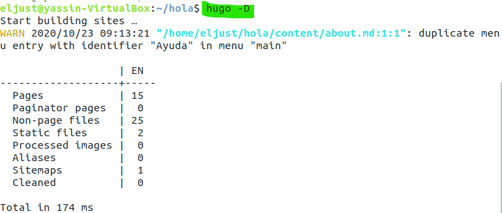

&nbsp;
Esto generara la carpeta public, cuyo contenido deberemos copiar a la carpeta **/var/www/html** del servidor 
> 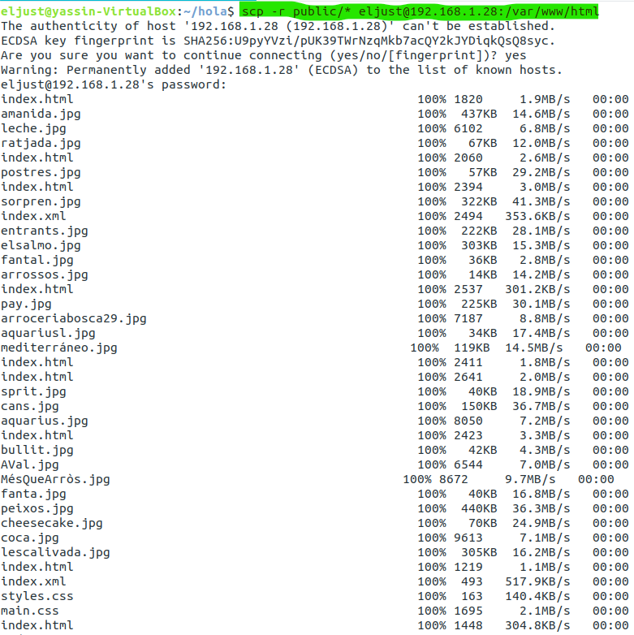

&nbsp;
Para comprobar que la configuración va bien, entramos a un navegador en mi maquina real y ejecutar el **baseURL** del sitio y veremos
> 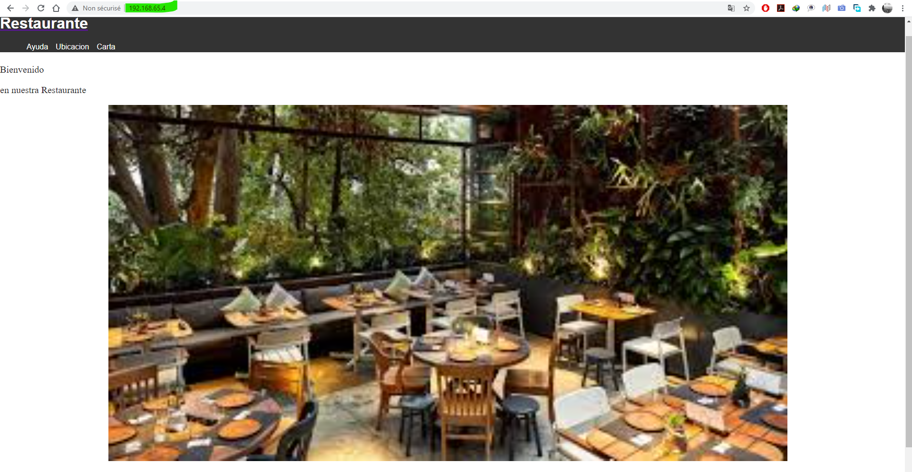

&nbsp;
Y como vemos el sitio web funciona y toda configuración estaba bien.