# SERVER WEB

&nbsp;

Servidor de alojamiento web gratuito hay muchos por ejemplo **000webhost.com**, **Infinityfree.net**, **AWS**… en nuestro caso elegimos ***000webhost*** y publicamos en este último nuestro sitio web. 

&nbsp;

Para subir nuestro sitio web al servidor de alojamiento:

&nbsp;

>En primer debemos entrar a sitio web de 000webhost y registrar con una cuenta 
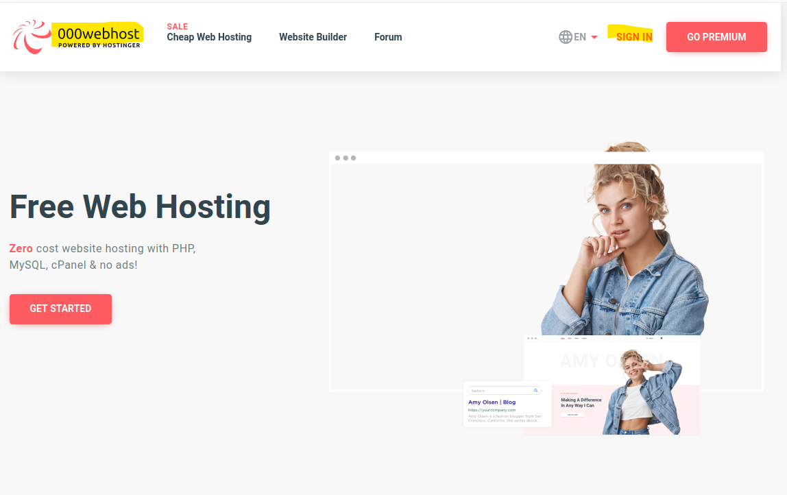

&nbsp;

>Luego de registrar te muestra una página como la siguiente y pulsa sobre **“LET’S CREATE SOME MAGIC”** como en la foto siguiente:
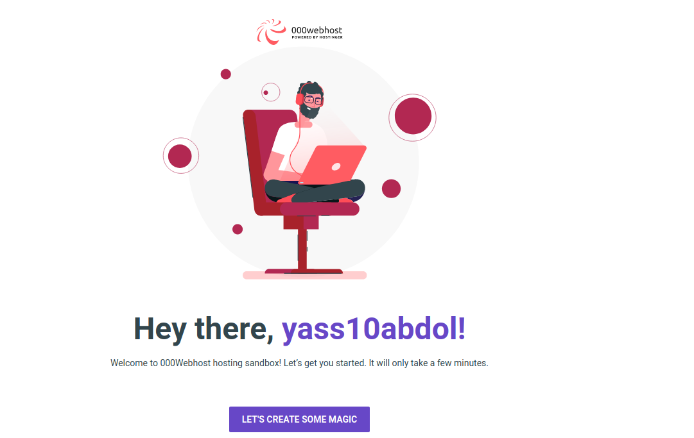

&nbsp;

>Luego te pregunta que quieres hacer, el tipo de sitio, en nuestro caso elegir **“other”**
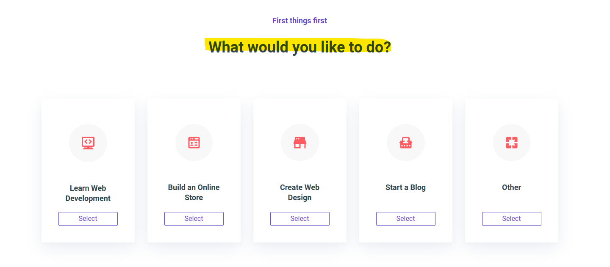

&nbsp;

>Después me aparece un pagina y haz un clic sobre **“Skip”**
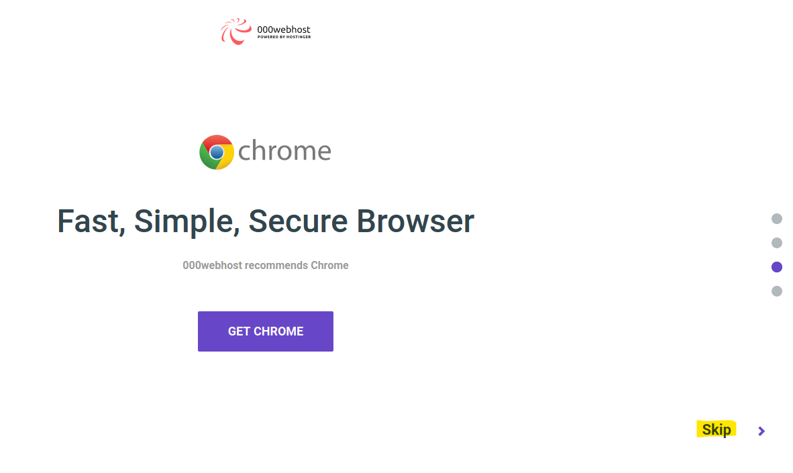

&nbsp;

>Luego nos vamos a dar un nombre de nuestro proyecto y pulsamos sobre **“SUBMIT”**
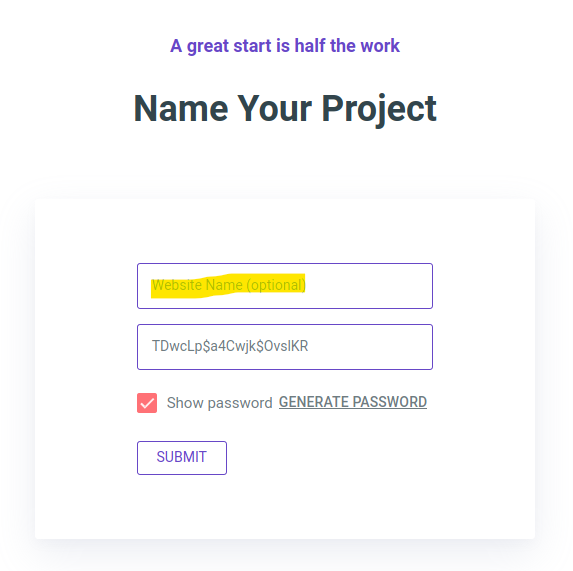

&nbsp;

>Después elegimos que subir el nuestro sitio web (**Upload your site**)
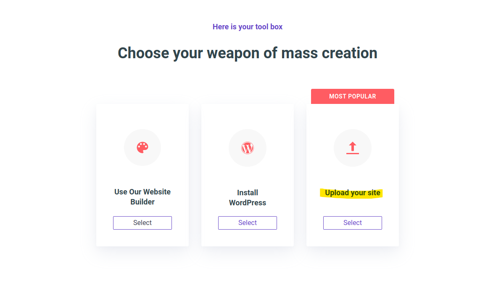

&nbsp;

>Y me muestra como en la foto siguiente:
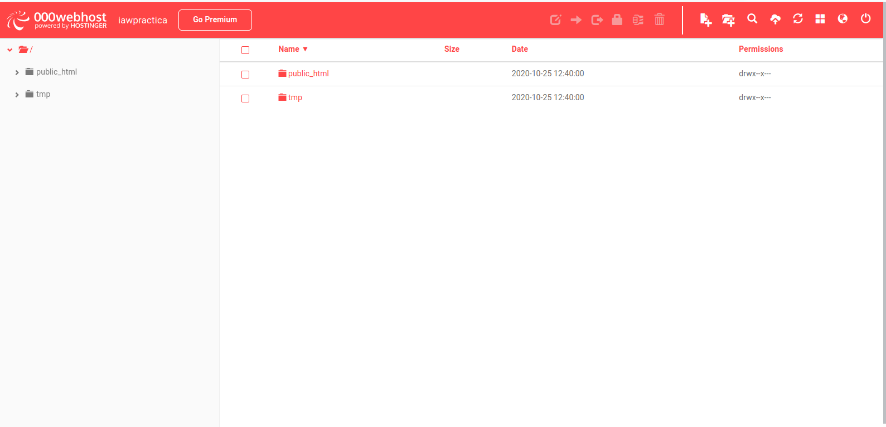

&nbsp;

>Ahora debemos eliminar el fichero “public_html” y haz un clic sobre el botón de subir ficheros el como aparece en la siguiente foto 
&nbsp;

>

&nbsp;

>Luego me muestra una ventana en el que podemos seleccionar la nuestra carpeta **public** el que tiene el contenido del nuestro sitio web el ha generado con **Hugo -D**
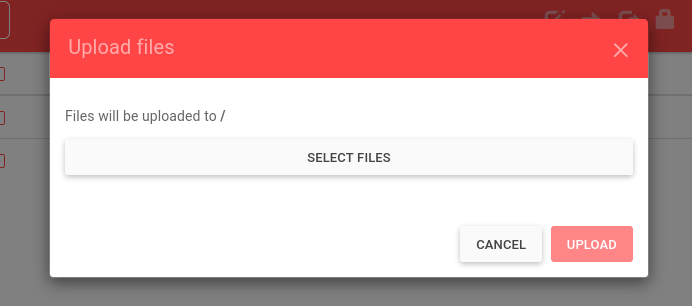
 

&nbsp;

>Y cuando seleccionamos la carpeta, hacemos un clic sobre **“UPLOAD”** para subir la carpeta el que tiene contenido de nuestro sitio web a servidor **000webhost**
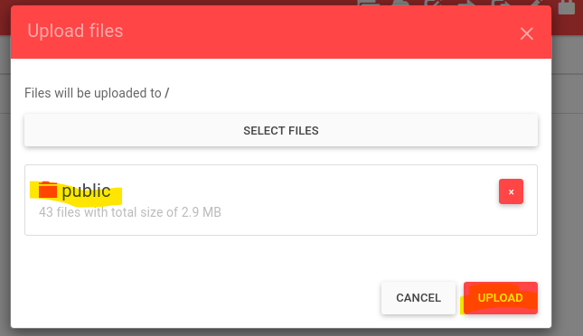

&nbsp;

>Cuando termina el **UPLOAD** debemos renombrar la carpeta **public** a **public_html**, y para hacer esto seleccionar la carpeta **public** y hacemos un clic sobre icono se llama **“Rename”** como se nos muestra en la siguiente imagen
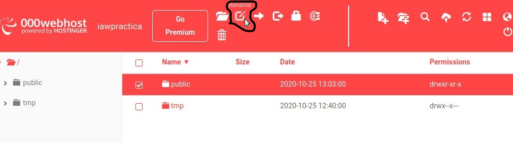
 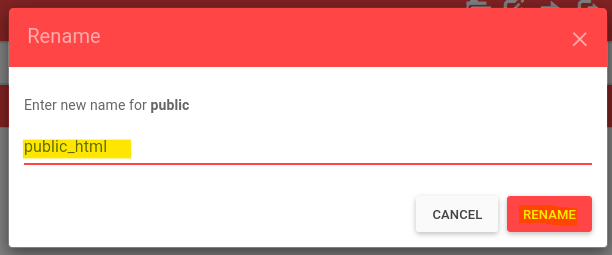
  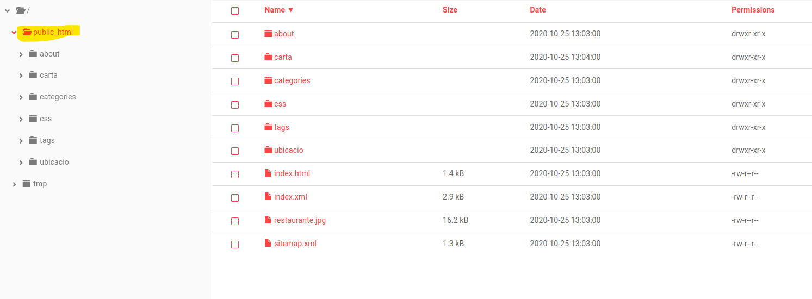

&nbsp;

>Ahora comprobamos que sitio web funciona bien, vamos a pagina **My websites** en **000webhost** y hacemos un clic sobre el enlace como en la foto:
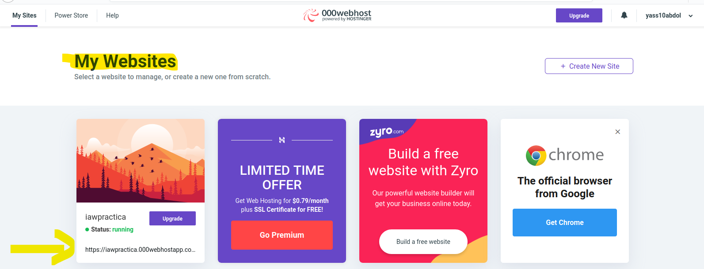

&nbsp;

>Y me muestra com la seguiente:
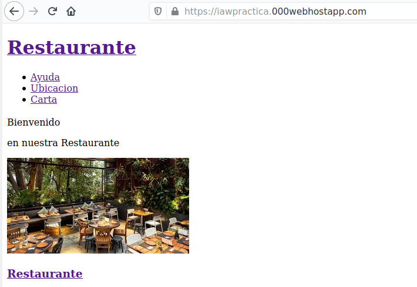

&nbsp;

>Y como vemos El sitio web funciona, pero debemos cambiar unas cosas en **index** de cada página y también cambiar el theme de la página como veremos en las siguientes fotos:
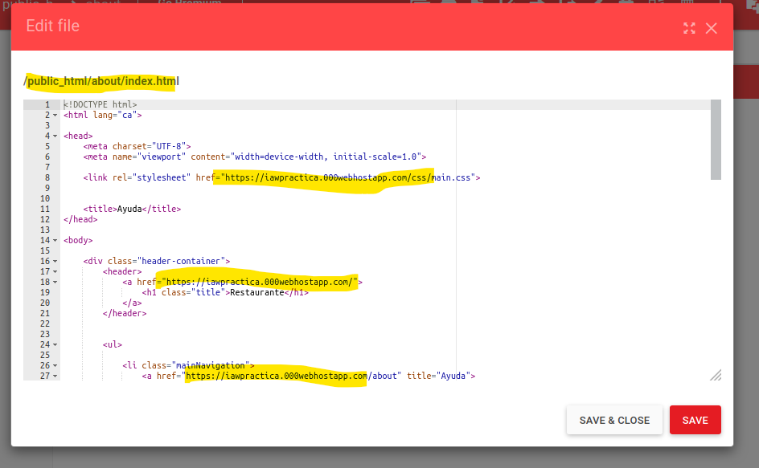

&nbsp;

>En esta foto cambiamos el link el que estaba como una dirección de Hugo a donde ponemos el sitio web para podemos funcionar css y otros enlaces como de about y de pagina inicial etc… como hacemos en este paso aplicamos a todas las otras páginas.

&nbsp;

>Antes
&nbsp;

>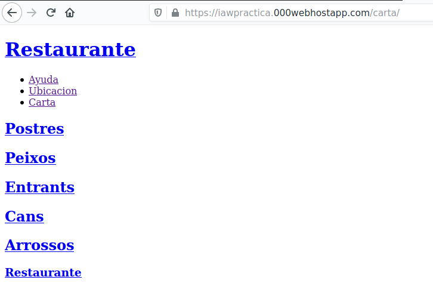

&nbsp;

>Modificar fichero index.html de carta:
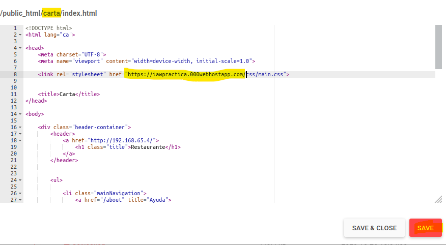

&nbsp;

>Después de modificación:
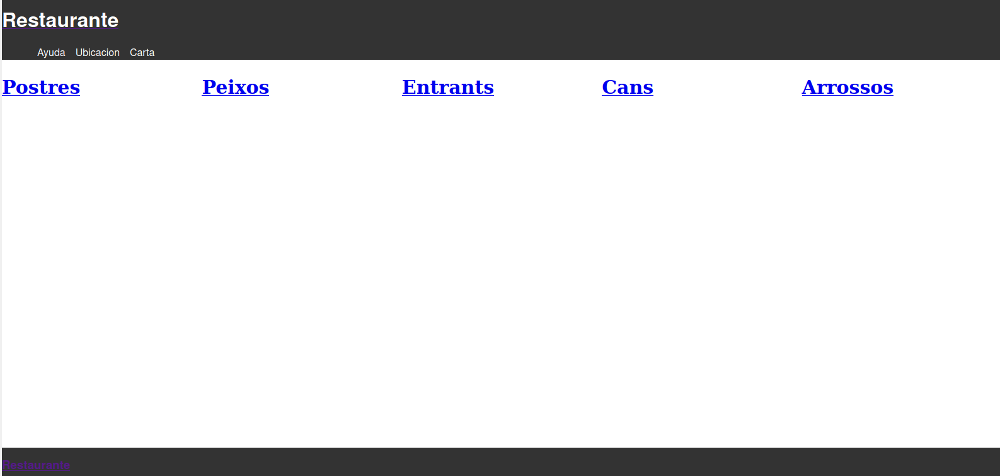
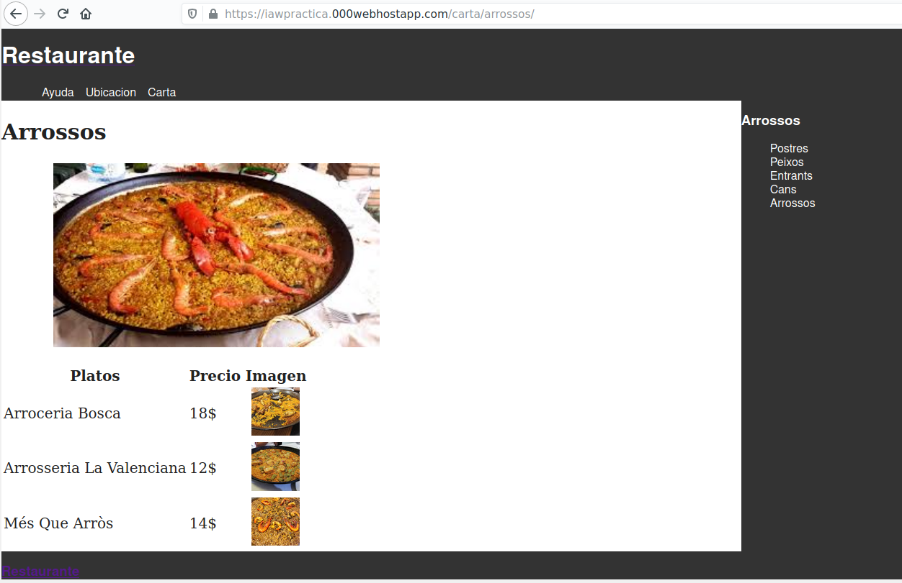
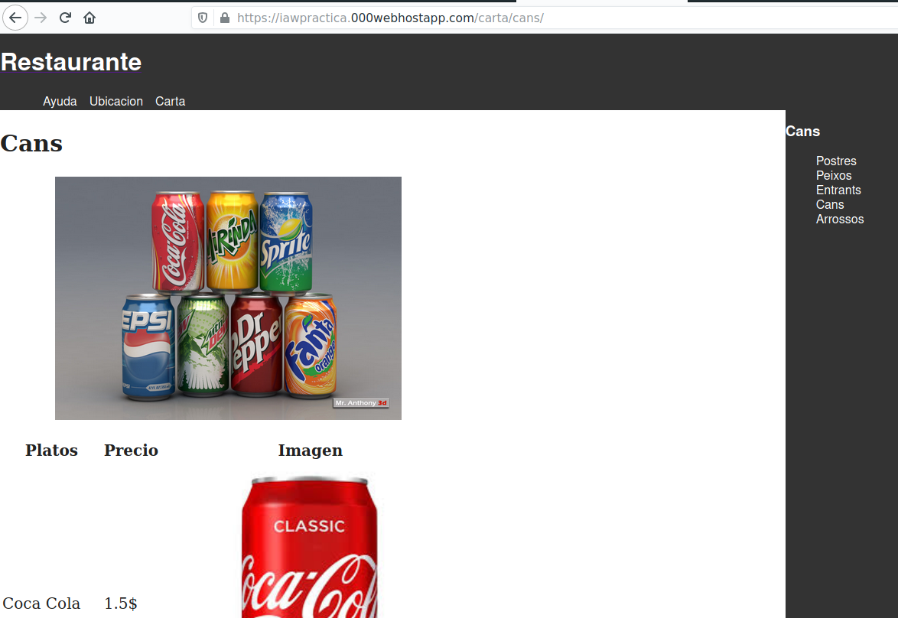

&nbsp;